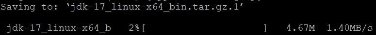
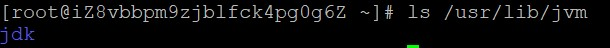
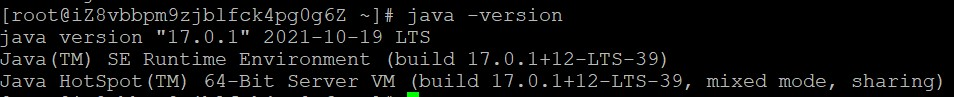

## Linux(Centos7)安装jvm

#### 1、查看版本和下载地址

可以在如下网站上找到并下载相应版本

[http://www.oracle.com/technetwork/java/javase/downloads/jdk8-downloads-2133151.html]()

#### 2、JDK下载

用wget指令下载jdk的压缩包(如果url不一致可以将后面的url改成你的)

`wget --no-check-certificate --no-cookies --header "Cookie: oraclelicense=accept-securebackup-cookie" https://download.oracle.com/java/17/latest/jdk-17_linux-x64_bin.tar.gz`
如下就是在下载了

#### 3、解压压缩文件

文件名要更换成自己的

`tar -zxvf jdk-17_linux-x64_bin.tar.gz`

#### 4、创建目录(JDK安装的目录)

`sudo mkdir /usr/lib/jvm`

#### 5、然后将解压后的文件夹移动到此目录并重命名

移动：`sudo mv jdk-17.0.1 /usr/lib/jvm`

重命名：`sudo mv /usr/lib/jvm/jdk-17.0.1 /usr/lib/jvm/jdk `

查看是否成功：`ls /usr/lib/jvm`

#### 6、配置环境变量

打开配置文件：`vim /etc/profile`

在末尾粘贴如下代码

`export JAVA_HOME=/usr/lib/jvm/jdk
export JRE_HOME=${JAVA_HOME}/jre
export CLASSPATH=.:${JAVA_HOME}/lib:${JRE_HOME}/lib
export PATH=${JAVA_HOME}/bin:$PATH`

JAVA_HOME路径要填你的jdk具体所在目录

#### 7、使配置生效

`source /etc/profile`

#### 8、检查是否配置成功

输入 `java –version` 查看jdk版本

如上图便是成功
