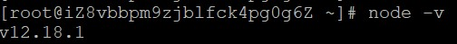

## node.js安装

#### 1、下载node.js

`wget https://nodejs.org/dist/v12.18.1/node-v12.18.1-linux-x64.tar.xz `

#### 2、解压并重命名

解压：`tar xf node-v12.18.1-linux-x64.tar.xz `

重命名：`mv ./node-v12.18.1-linux-x64 ./nodejs`

#### 3、将解压后的文件夹移动到/usr/lib目录

` mv ./nodejs /usr/lib`

####  4、配置环境变量

打开配置文件：`vim /etc/profile`

将代码 `export PATH=$PATH:/usr/lib/nodejs/bin` 粘贴在文件末尾

使配置生效：`source /etc/profile`

#### 5、检查是否配置成功

`node -v`

